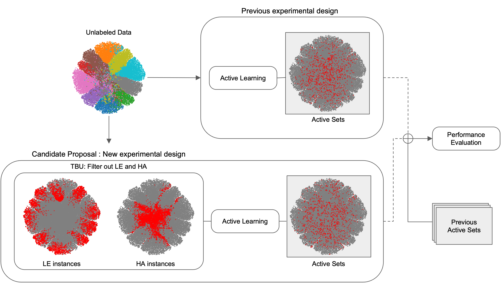

# Transferable Candidate Proposal with Bounded Uncertainty (TBU)

<p align="center">


### 1. docker container
```bash
docker pull pytorch/pytorch:1.13.1-cuda11.6-cudnn8-devel
docker run -it --shm-size=8G \
    --gpus=all --restart=always \
    pytorch/pytorch:1.13.1-cuda11.6-cudnn8-devel \
    /bin/bash
```

### 2. library install
```bash
pip install scikit-learn
```

### 3. experiment script

#### Baselines
- SAME: The proxy and the target coincide. In other words, the target selects the subset by itself from the unconstrained pool of unlabeled data.
```bash
python main.py --export_id cifar10 --proxy_arc res-18 --target_arc res-18 \
    --n_init 1000 --n_query 1000 --gpu_id 0 --algorithm Badge \
    --n_filter -1 --percentile -1.0 --seed 3061
```

- DIFF: The proxy and the target have different architectures and the proxy selects a fixed-sized subset on behalf of the target.
```bash
python main.py --export_id cifar10 --proxy_arc wrn-28-2 --target_arc res-18 \
    --n_init 1000 --n_query 1000 --gpu_id 0 --algorithm Badge \
    --n_filter -1 --percentile -1.0 --seed 3061
```

- SEMI: Keeping all other conditions identical to DIFF, the proxy is trained by semi-supervised learning.
```bash
python main.py --export_id cifar10 --proxy_arc wrn-28-2 --target_arc res-18 \
    --n_init 1000 --n_query 1000 --gpu_id 0 --algorithm Badge \
    --n_filter -1 --percentile -1.0 --semi --seed 3061
```

#### Candidate Proposal
- TBU: Keeping all other conditions identical to SEMI, the proxy constrains the informative data candidates of any size in unlabeled dataset by filtering out the instances of low epistemic and high aleatoric uncertainty. Then, the target selects the fixed sized subset within the candidates.
```bash
python main.py --export_id cifar10 --proxy_arc wrn-28-2 --target_arc res-18 \
    --n_init 1000 --n_query 1000 --gpu_id 0 --algorithm Badge \
    --n_filter 5 --percentile 0.1 --semi --seed 3061
```