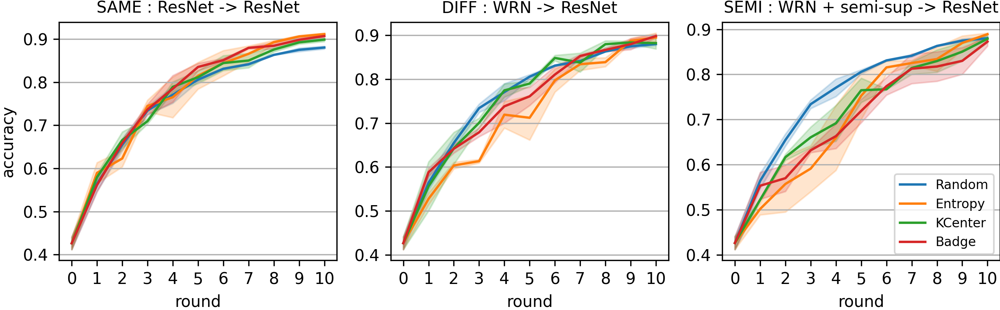
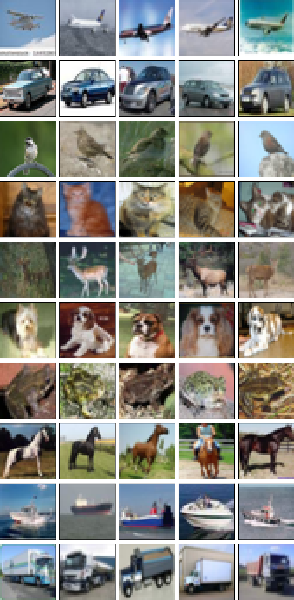
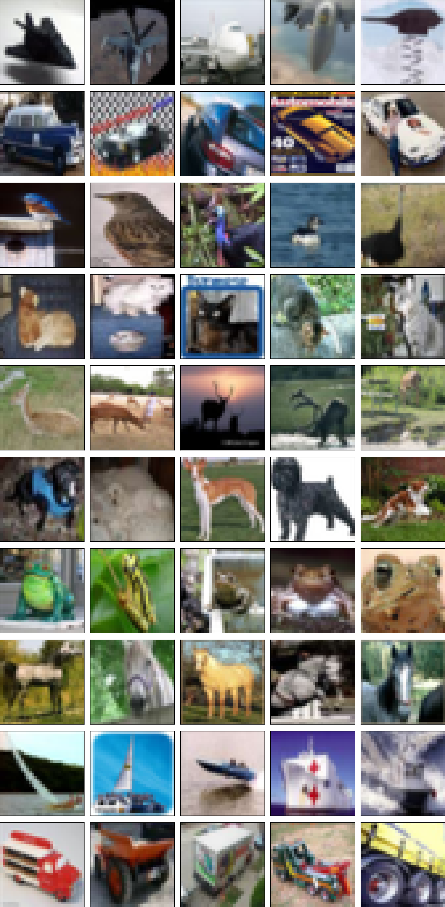
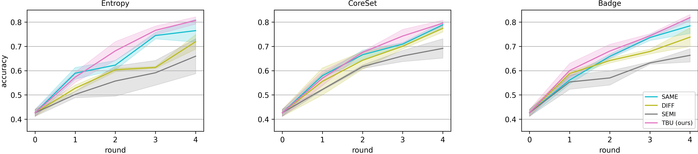
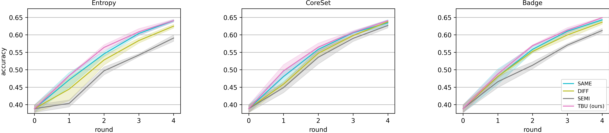

# Transferable Candidate Proposal with Bounded Uncertainty (TBU)

Accepted in NeurIPS 2023 Workshop on **[Adaptive Experimental Design and Active Learning in the Real World](https://realworldml.github.io/neurips2023/)**

Author : Kyeongryeol Go and Kye-Hyeon Kim in [Superb AI](https://superb-ai.com/)

Arxiv link : https://arxiv.org/abs/2312.04604


### Description

When there is a mismatch in architectures or learning algorithms, a subset chosen by a proxy model offers no advantage over random sampling when fed to target models. 

<p align="center">


Candidate Proposal can verify the transferability depending on model configurations. Compared to the previous experimental design, the limited awareness of the proxy model regarding target models is compensated by refining the role of the proxy while expanding the role of the target. Here, TBU selects transferable candidates by excluding instances of (1) low-epistemic (LE) or (2) high-aleatoric (HA) uncertainty.

<p align="center">


LE instances show stronger semantic similarity in their imagery, while HA instances incorporate unusual patterns like fragmented object components. In short, LE instances can be easily substituted by others, and HA instances can lead to incorrect inductive bias in the model training. Particularly, in the early rounds of the active learning cycle, the labeled data is scarce and more instances in the unlabeled data tend to be assigned to HA instances. In contrast, in the later rounds, LE instances would become dominant in numbers as the model prediction gets more accurate and calibrated.

| LE instances | HA instances |
|:---:|:---:|
|  |  |

We compare the per-round accuracy with variations in data sets and target model architectures. Note that solid lines indicate the average over three random seeds and the shaded region represents one standard deviation. TBU could outperform most of the baselines and verify its complementary effect on existing active learning algorithms.

<p align="center">
  <t>1) CIFAR-10 (I=1000, K=1000)</t>
  <br>
  
</p>

<p align="center">
  <t>2) CIFAR-100 (I=5000, K=2500)</t>
  <br>
  
</p>

### Installation

#### docker container
```bash
docker pull pytorch/pytorch:1.13.1-cuda11.6-cudnn8-devel
docker run -it --shm-size=8G \
    --gpus=all --restart=always \
    pytorch/pytorch:1.13.1-cuda11.6-cudnn8-devel \
    /bin/bash
```

#### library install
```bash
pip install scikit-learn
```

### Experiment

#### Baselines
- SAME: The proxy and the target coincide. In other words, the target selects the subset by itself from the unconstrained pool of unlabeled data.
```bash
python main.py --export_id cifar10 --proxy_arc res-18 --target_arc res-18 \
    --n_init 1000 --n_query 1000 --gpu_id 0 --algorithm Badge \
    --n_filter -1 --percentile -1.0 --seed 3061
```

- DIFF: The proxy and the target have different architectures and the proxy selects a fixed-sized subset on behalf of the target.
```bash
python main.py --export_id cifar10 --proxy_arc wrn-28-2 --target_arc res-18 \
    --n_init 1000 --n_query 1000 --gpu_id 0 --algorithm Badge \
    --n_filter -1 --percentile -1.0 --seed 3061
```

- SEMI: Keeping all other conditions identical to DIFF, the proxy is trained by semi-supervised learning.
```bash
python main.py --export_id cifar10 --proxy_arc wrn-28-2 --target_arc res-18 \
    --n_init 1000 --n_query 1000 --gpu_id 0 --algorithm Badge \
    --n_filter -1 --percentile -1.0 --semi --seed 3061
```

#### Candidate Proposal
- TBU: Keeping all other conditions identical to SEMI, the proxy constrains the informative data candidates of any size in unlabeled dataset by filtering out the instances of low epistemic and high aleatoric uncertainty. Then, the target selects the fixed sized subset within the candidates.
```bash
python main.py --export_id cifar10 --proxy_arc wrn-28-2 --target_arc res-18 \
    --n_init 1000 --n_query 1000 --gpu_id 0 --algorithm Badge \
    --n_filter 5 --percentile 0.1 --semi --seed 3061
```

If you use TBU in your research, please use the following BibTeX entry.
```
@misc{go2023transferable,
      title={Transferable Candidate Proposal with Bounded Uncertainty}, 
      author={Kyeongryeol Go and Kye-Hyeon Kim},
      year={2023},
      eprint={2312.04604},
      archivePrefix={arXiv},
      primaryClass={cs.LG}
}
```